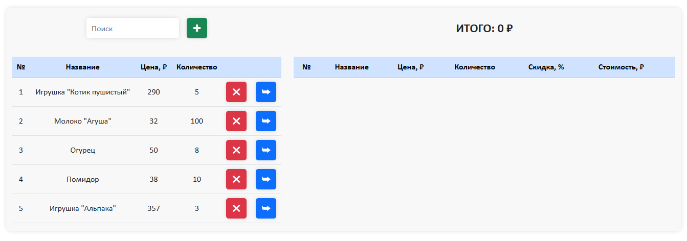
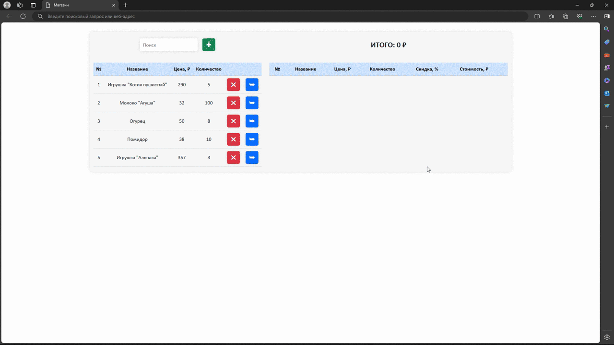
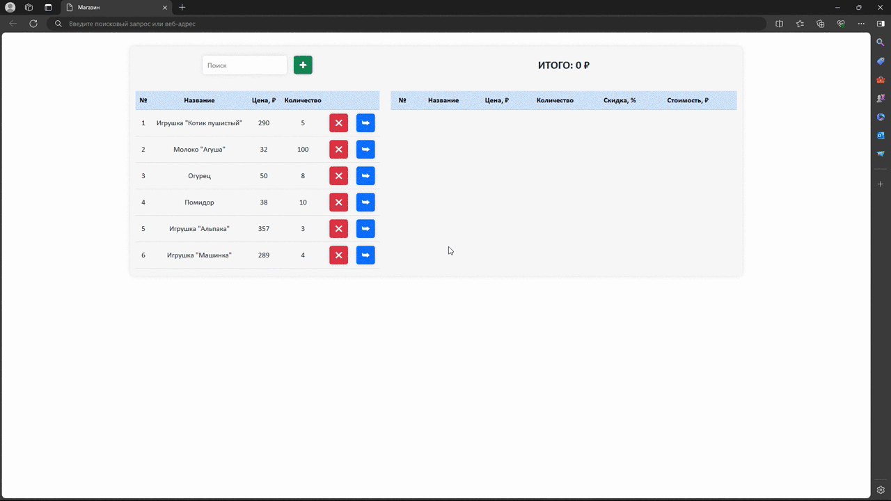
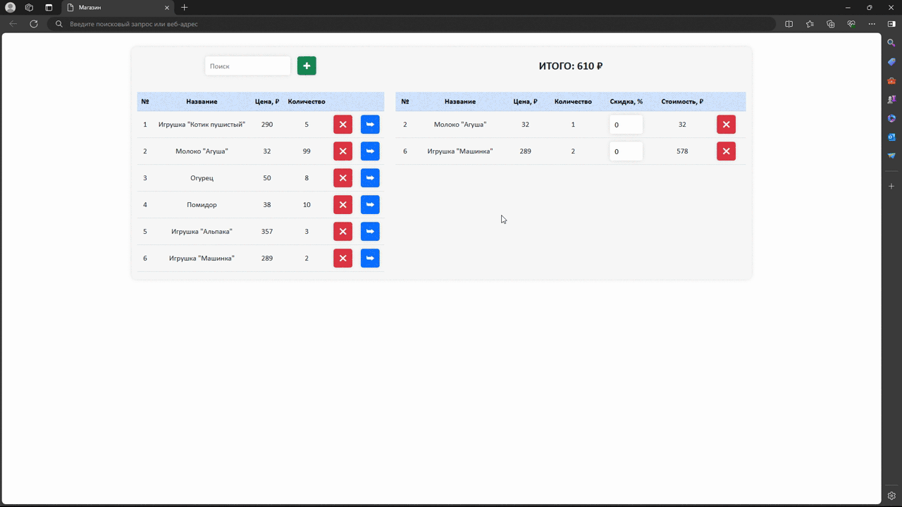
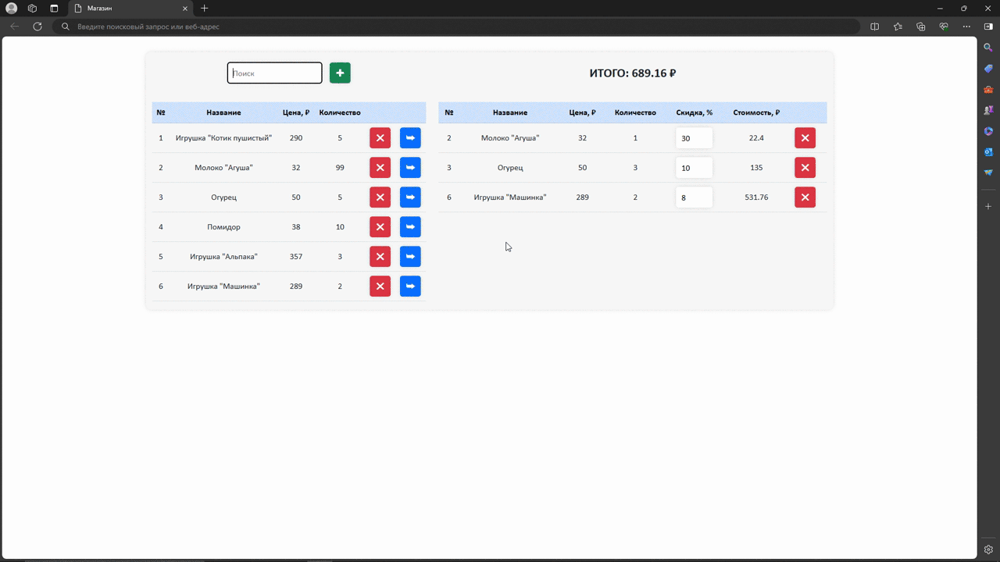
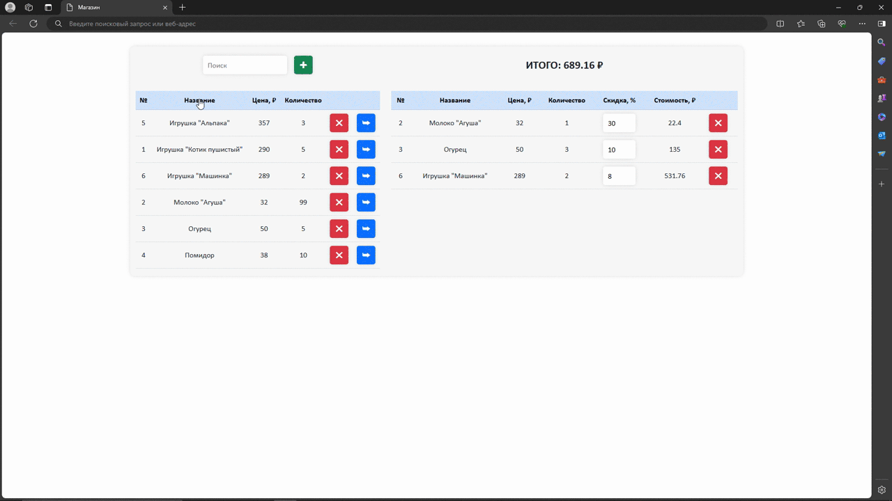

# Mini-Store
Небольшое SPA, имитирующее работу мини-магазина. Здесь можно добвалять и удалять товары из каталога магазина, а также добавлять и удалять товары из корзины. В разработке использовались HTML, CSS, JS и Bootstrap 5.

## Превью

---
*Добавление нового товара в каталог магазина*:

---
*Добавление и удаление товаров из корзины*:

---
*Применение скидки к товарам в корзине*:

---
*Поиск товаров по названию в каталоге*:

---
*Сортировка товаров в каталоге*:

---
*Удаление товаров из каталога*:

## Как использовать
* Запустить проект можно, например, по следующей ссылке: [Mini-Store](https://helluna.github.io/Mini-Store/).
* Все добавленные товары сохраняются в localStorage. При повтороном запуске будут показаны те состояния каталога и корзины, которые были оставлены перед закрытием сайта на этом устройстве.
* Добавить новый товар в каталог магазина можно по кнопке "+" вверху экрана.
* Товары можно удалять из каталога магазина. Если такие товары были добавлены в корзину, то оттуда они также удалятся.
* Товары из каталога можно добавлять в корзину, нажав соответствующую кнопку.
    - Количество товаров в каталоге ограничено.
    - При добавлении товара в корзину, его количество в каталоге уменьшается.
    - Если в каталоге не осталось товаров этого вида, то этот товар больше нельзя добавить в корзину.
    - Итоговая стоимость товаров в корзине отражается вверху экрана.
* К товарам в корзине можно применять различные скидки от 0% до 100%.
* Товары можно убирать из корзины. При этом количество товара в каталоге магазина, соответственно, увеличится.
* Можно искать товары по названию в каталоге через строку поиска.
* Можно сортировать товары по всем столбцам как в каталоге, так и в корзине.
